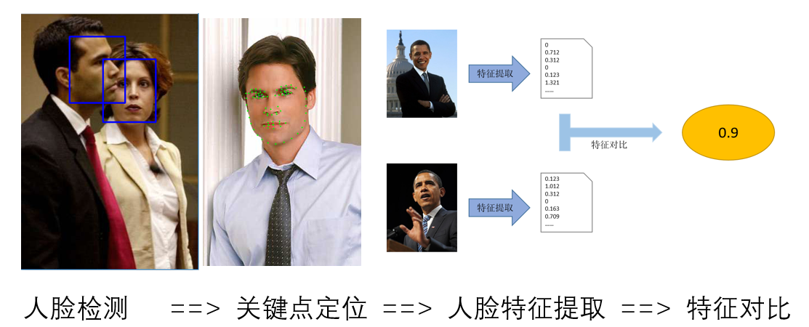
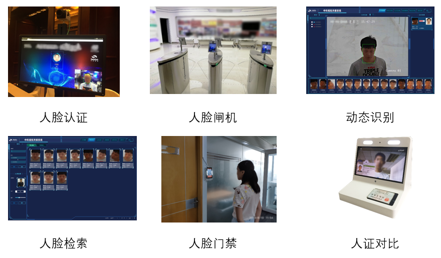

# **SeetaFace2**

[](LICENSE)

[中文](./README.md) [English](./README_en.md)

## 1 Introduction
The `SeetaFace2` face recognition engine includes three core modules required to build a fully automated face recognition system: face detection module `FaceDetector`, facial key positioning module `FaceLandmarker` and face feature extraction and Compare the module `FaceRecognizer`. There will be additional auxiliary modules such as open source face tracking and closed eye detection.

<div align=center>

</div>

`SeetaFace2` is developed in standard C++. All modules do not depend on any third-party libraries and support x86 architecture (Windows, Linux) and ARM architecture (Android). The top applications supported by SeetaFace2 include, but are not limited to, face access, insensitivity, face matching, and the like.

<div align=center>

</div>


SeetaFace2 is a milestone version for face recognition business. The face detection module can achieve more than 92% recall rate under 100 false detection conditions on FDDB. Face key point positioning supports 5 points and 81 points positioning. A face recognition application that supports thousands of people's base libraries than the N module.


Modules | Method Overview | Basic Specifications | Typical Platform Speed
-----|---------|-------------|------------
** Face Detection** | Cascaded CNN | FDDB has a recall rate of 92% (100 false detections). 40 Minimal Face <br>I7: 70FPS(1920x1080)<br>RK3399: 25FPS(640x480)
** Facial closure point positioning (81 points and 5 points)** | FEC-CNN | Average positioning error (normalized according to the center distance between the two eyes)<br>0.069 on the 300-W Challenge Set. | I7: 450FPS and 500FPS<br>RK3399: 110FPS and 220FPS
**Face feature extraction and comparison** | ResNet50 | Recognition: In the general 1:N+1 scenario, when the error acceptance rate is 1%, <br>1000 base library, the preferred recognition rate is over 98%,<br> The 5,000-person base library has a preferred recognition rate of over 95%. | I7: 8FPS<br>RK3399: 2.5FPS

Compared to the 2016 open source `SeetaFace 1.0`, `SeetaFace2` has an order of magnitude improvement in both speed and accuracy.

<table>
    <tr>
        <th rowspan="2">Version</th>
        <th colspan="2">Face Detection</th>
        <th colspan="2">Key Point Positioning</th>
        <th colspan="2">Face Recognition</th>
        <th rowspan="2">Third-party dependencies</th>
    </tr>
    <tr>
        <td>Speed ​​[1]</td>
        <td>single precision [2]</td>
        <td>speed</td>
        <td>Features</td>
        <td>Training data size</td>
        <td>Application</td>
    </tr>
    <tr>
        <th>1.0</th>
        <td>16FPS</td>
        <td>85%</td>
        <td>200FPS</td>
        <td>5 points</td>
        <td>1.4 million sheets</td>
        <td>Laboratory</td>
        <td>no</td>
    </tr>
    <tr>
        <th>2.0</th>
        <td>77FPS</td>
        <td>92%</td>
        <td>500FPS</td>
        <td>5/81 points</td>
        <td>33 million sheets</td>
        <td>Business Environment</td>
        <td>no</td>
    </tr>
    <tr>
        <th>Remarks</th>
        <td colspan="7">
            [1] 640x480 input, detection 40x40 face, I7-6700. <br>
            [2] The accuracy of face detection refers to the recall rate of 100 misunderstood FDDB data sets.
        </td>
    </tr>
</table>

Knowing people to understand everything, open source empowerment and development. `SeetaFace2` is committed to the development of AI, and together with industry partners to promote the face recognition technology.


## 2. Compile
### 2.1 Compiling dependencies
+ compilation tool
  + For linux
    - GNU Make tool
    - GCC or Clang compiler
  + For windows
    - [MSVC](http://msdn.microsoft.com/en-us/vstudio) or MinGW. 
  - [CMake](http://www.cmake.org/)
+ dependent library
  - [Optional] [OpneCV](http://opencv.org/) Required only when compiling examples
+ dependency architecture
  - CPU supports SSE2 and FMA [optinal] (x86) or NENO (ARM) support

### 2.2 Compile parameter
  - PLATFORM: [STRING] Compile target architecture, x86/x86_64/amd64 does not need to be set, ARM architecture needs to be set to corresponding platform
  - BUILD_DETECOTOR: Whether to compile the face detection module. ON: On; OFF: Off
  - BUILD_LANDMARKER: Whether to compile the face key positioning module. ON: On; OFF: Off
  - BUILD_RECOGNIZER: Whether to compile the face feature extraction and comparison module. ON: On; OFF: Off
  - BUILD_EXAMPLE: Whether to compile the example. ON: On; OFF: Off, open requires pre-installation of `OpneCV`
  - CMAKE_INSTALL_PREFIX: Installation prefix
  - SEETA_USE_FMA: Whether use `FMA` instructions. Default off. Only works in `x86` architecture.

### 2.3 Platforms
#### 2.3.1 linux
  - Dependence
    + opencv. Only need to compile the example

        sudo apt-get install libopencv-dev 

  - Compile

        cd SeetaFace2
        mkdir build
        cd build
        cmake .. -DCMAKE_BUILD_TYPE=Release -DCMAKE_INSTALL_PREFIX=`pwd`/install -DBUILD_EXAMPLE=OFF # Set to ON if there is OpneCV
        cmake --build . --config Release

    + ARM architecture compilation requires a platform
    
        ```
        cmake .. -DCMAKE_BUILD_TYPE=Release -DCMAKE_INSTALL_PREFIX=`pwd`/install -DPLATFORM=arm
        cmake --build . --config Release
        ```
        
  - Installation

        cmake --build . --config Release --target install

  - Run the example
    + Add the directory of the build library to the variable LD_LIBRARY_PATH
 
            export LD_LIBRARY_PATH=$LD_LIBRARY_PATH:`pwd`/lib

    + Copy the model file to the model directory of the program execution directory

            cd SeetaFace2
            cd build
            cd bin
            mkdir model
            cp fd_2_00.dat pd_2_00_pts5.dat pd_2_00_pts81.dat .

    + Execute the program in the bin directory
      - points81


            cd SeetaFace2
            cd build
            cd bin
            ./point81

      - search

            cd SeetaFace2
            cd build
            cd bin
            ./search

#### 2.3.2 windows
  - Dependence
    + opencv. Only need to compile the example
  - Compile with the cmake-gui.exe tool. Open cmake-gui.exe
  - Command line compilation
    + Add the directory where the cmake command is located to the environment variable PATH
    + Open "VS2015 Developer Command Prompt" from the Start menu to enter the command line

      - Compile

            cd SeetaFace2
            mkdir build
            cd build
            cmake .. -DCMAKE_INSTALL_PREFIX=install -DCMAKE_BUILD_TYPE=Release -DBUILD_EXAMPLE=OFF # Set to ON if there is OpneCV
            cmake --build . --config Release

      - Installation

            cmake --build . --config Release --target install

      - Run the example
        + Copy the model file to the model directory of the program execution directory

                cd SeetaFace2
                cd build
                cd bin
                mkdir model
                cp fd_2_00.dat pd_2_00_pts5.dat pd_2_00_pts81.dat .

        + Execute the program in the bin directory
          - points81
          - search

#### 2.3.3 Android platform compilation instructions
+ Install ndk
  - Download and install to /home/android-ndk from https://developer.android.com/ndk/downloads 
  - Setting environment variables

        export ANDROID_NDK=/home/android-ndk

+ Complie
  - The host is linux

        cd SeetaFace2
        mkdir build
        cd build
        cmake .. -DCMAKE_INSTALL_PREFIX=install -DCMAKE_BUILD_TYPE=Release -DCMAKE_TOOLCHAIN_FILE=${ANDROID_NDK}/build/cmake/android.toolchain.cmake -DANDROID_ABI="armeabi-v7a with NEON" -DANDROID_PLATFORM=android-18 -DBUILD_EXAMPLE=OFF # 如果有OpenCV，则设置为ON
        cmake --build . --config Release --target install

  - The host is windows

        cd SeetaFace2
        mkdir build
        cd build
        cmake .. -DCMAKE_INSTALL_PREFIX=install -G"Unix Makefiles" -DCMAKE_BUILD_TYPE=Release -DCMAKE_TOOLCHAIN_FILE=${ANDROID_NDK}/build/cmake/android.toolchain.cmake  -DCMAKE_MAKE_PROGRAM=${ANDROID_NDK}\prebuilt\windows-x86_64\bin\make.exe -DANDROID_ABI=arm64-v8a -DANDROID_ARM_NEON=ON -DBUILD_EXAMPLE=OFF # 如果有 OpenCV，则设置为ON
        cmake --build . --config Release --target install

  - Parameter Description: https://developer.android.google.cn/ndk/guides/cmake
    + ANDROID_ABI: The following values can be taken:
       Goal ABI. If the target ABI is not specified, CMake uses armeabi-v7a by default.
       Valid ABI are:
      - armeabi：CPU with software floating point arithmetic based on ARMv5TE
      - armeabi-v7a：ARMv7-based device with hardware FPU instructions (VFP v3 D16)
      - armeabi-v7a with NEON：Same as armeabi-v7a, but with NEON floating point instructions enabled. This is equivalent to setting -DANDROID_ABI=armeabi-v7a and -DANDROID_ARM_NEON=ON.
      - arm64-v8a：ARMv8 AArch64 Instruction Set
      - x86：IA-32 Instruction Set
      - x86_64 - x86-64 Instruction Set
    + ANDROID_NDK <path> The path of installed ndk in host
    + ANDROID_PLATFORM: For a full list of platform names and corresponding Android system images, see the [Android NDK Native API] (https://developer.android.google.com/ndk/guides/stable_apis.html)
    + ANDROID_ARM_MODE
    + ANDROID_ARM_NEON
    + ANDROID_STL:Specifies the STL that CMake should use. 

#### 2.3.4 IOS platfrom
> example IOS device.

+ Dependence
  - One PC within MacOS.
  - Source code from `git`

+ Command lines
  + Use `cmake` compile and install
    ```
    cd SeetaFace2
    mkdir build
    cd build
    chmod +x ../ios/cmake.sh
    ../ios/cmake.sh -DCMAKE_INSTALL_PREFIX=`pwd`/install
    make -j4
    make install
    ```

    After all commands above succeed, libraries would install into `SeetaFace2/build/install`.

  + Compile for simlulator.
    Change `cmake` parameters like: `../ios/cmake.sh -DIOS_PLATFORM=SIMULATOR64 -DPLATFORM=x64`

  + See `<root>/ios/cmake.sh` and `<root>/ios/iOS.cmake` for more compilation controls.

## 3. Directory structure


    |-- SeetaFace2  
        |-- documents (SDK interface documentation)  
        |-- example(C++ version SDK sample code)  
        |-- FaceDetector  
        |-- FaceLandmarker(Feature Point Positioning Module)  
        |-- FaceRecognizer (Face Feature Extraction and Alignment Module)  
        |-- SeetaNet (forward computing framework module)  

    
## 4. Model download
- Face Detection Module FaceDetector Model Download Link:  
MD5 : E88669E5F1301CA56162DE8AEF1FD5D5  
Baidu network disk: https://pan.baidu.com/s/1Dt0M6LXeSe4a0Pjyz5ifkg Extraction code: fs8r  
Dropbox : https://www.dropbox.com/s/cemt9fl48t5igfh/fd_2_00.dat?dl=0

- Facial feature 5-point positioning module FaceLandmarker model download link:  
MD5: 877A44AA6F07CB3064AD2828F50F261A  
Baidu network disk: https://pan.baidu.com/s/1MqofXbmTv8MIxnZTDt3h5A Extraction code: 7861  
Dropbox : https://www.dropbox.com/s/noy8tien1gmw165/pd_2_00_pts5.dat?dl=0

- Face feature 81 point positioning module FaceLandmarker model download link:  
MD5 : F3F812F01121B5A80384AF3C35211BDD  
Baidu network disk: https://pan.baidu.com/s/1CCfTGaSg_JSY3cN-R1Myaw Extraction code: p8mc  
Dropbox : https://www.dropbox.com/s/v41lmclaxpwow1d/pd_2_00_pts81.dat?dl=0

- Facial feature extraction and comparison module FaceRecognizer model download link:  
MD5 : 2D637AAD8B1B7AE62154A877EC291C99  
Baidu network disk: https://pan.baidu.com/s/1y2vh_BHtYftR24V4xwAVWg Extraction code: pim2  
Dropbox : https://www.dropbox.com/s/6aslqcokpljha5j/fr_2_10.dat?dl=0

## 5. example
### 5.1 This project comes with examples

The `example/search/example.cpp` example shows a simple and complete process for face recognition, including:  
  1. Pre-registered images in the face-to-face recognition base library (the default registration in the example is "1" .jpg "Face in the face";
  2. Turn on the camera to detect the face in the camera screen; 3. Identify the detected face and determine the identity of the face.

If the tester wants to successfully identify his face in the bottom library, he needs to add the image named after his own name (name + .jpg) in the bottom register registration list of example.cpp, and copy the image file named by his own name. Go to the program's running directory, recompile example and run the program to test the recognition effect.


### 5.2 Other projects that have used this project

FaceRecognizer: https://github.com/KangLin/FaceRecognizer

SeetaFace2AndroidDemo: https://github.com/xiaoxiaoazhang/SeetaFace2AndroidDemo

## 6. Developer Community
Developers are welcome to join the SeetaFace developer community, please add SeetaFace assistant helper WeChat, after review, invite to join the group.


## 6.1 Code Contribution
Developers are welcome to contribute quality code, and all developer code needs to be submitted in the `develop` branch.

## 7. Business cooperation
If you want to purchase the `SeetaFace` commercial version engine for more accurate and faster face recognition algorithms or more for face verification, expression recognition, heart rate estimation, attitude estimation, line-of-sight tracking, etc., please contact Business Email bd@seetatech.com.

## 8. Open source agreement

`SeetaFace2` is open source according to [BSD 2-Clause license] (LICENSE).
